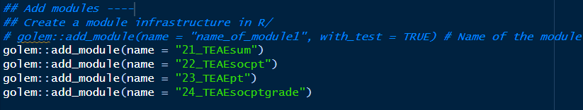

# 00-使用{Golem}搭建Rshiny project指南 <!-- omit in toc -->

>作者：王靖雅 <br>
>发布日期：2025-03-25 <br>
>版本：v1.0

### Content
- [Part1：新建golem Project](#part1新建golem-project)
- [Part2：配置文件介绍 \& 开发环境准备](#part2配置文件介绍--开发环境准备)
- [Part3：添加内置数据](#part3添加内置数据)
- [Part4：程序运行、打包](#part4程序运行打包)
- [Plus：使用Gitlab进行版本控制和协作](#plus使用gitlab进行版本控制和协作)
<hr>

## Part1：新建golem Project
R中安装golem包后，依次点击File - New Project - New Directory - Create Package for Shiny App using golem创建项目文件夹。

<hr>

## Part2：配置文件介绍 & 开发环境准备
打开以下文件并依次根据需求修改运行：
- **dev/01_start.R**：首次setup时需逐行运行并修改对应部分信息。
  后续更新只需要修改pkg_version并重跑这段命令。
  
<br>

- **dev/02_dev.R**：在开发过程中根据需求添加package dependence，function以及module文件。
  1. **Package Dependencies**
    
      - 后续更新需运行***attachment::att_amend_desc()*** 对开发文件注释import importFrom中提到的package和function进行提取，该部分会自动更新至文件NAMESPACE
    
      - 后续更新需运行***usethis::use_package("dplyr")*** 手动增加需要用到的package，并对应至DESCRIPTION文件
    
  2. **Add modules**
    每次新增modules时需要使用以下命令添加，这里一般存放单个界面的module：
  
  3. **Add functions**
    functions分为生成adam的function，与单个module相关的function，常用的global function。在以下部分增加：
  
  ***建议命名方式统一，生成adam的function统一为gen_adxx，module统一为xx_functionname（其中xx是对应部分的id，按照界面的顺序依次赋值。）***  
  增加的modules和functions会自动生成至R文件夹下，每个文件都具有对应的初始模板。
    
<hr>

## Part3：添加内置数据
>用于存放ADaM生成所需的spec文件adxx.json，以及转化为可在gen_adxx.R中调用的格式的宏。

1. 在**dev/02_dev.R**中运行或添加以下代码，会创建data-raw/文件夹，以及sysdata-RData.R文件。
   
2. 在该文件夹下创建adam/文件夹，用于存放adam.json文件以及文件转换代码，运行代码将json文件转化为RData格式输出至data-raw/文件夹下。
   
   
3. 修改**sysdata-RData.R**文件，加入load语句调用需要的RData，并在usethis::use_data()加入internal = TRUE设置。运行该文件后，内置数据会生成至**R/sysdata.rda**。
   
   
4. 在代码中直接以对应数据名称调用即可。
<hr>

## Part4：程序运行、打包
- **dev/run_dev.R**：清空当前系统环境，并以Package的形式运行该ShinyAPP。（更建议使用后续生成app.R文件）
  
<br>

- **dev/03_deploy.R**：用于APP部署的准备，以下是相关部分：
  
  ***devtools::build()*** 命令需要在每次打包为Package时使用。<br>
  ***golem::add_rstudioconnect_file()*** 仅需在首次setup时运行，会自动创建app.R程序，运行时生成ShinyAPP使用网页，文件如下。可根据添加option。
    
<hr>

## Plus：使用Gitlab进行版本控制和协作
>这里主要介绍当已存在git库时，如何将远程GitLab仓库克隆到本地使用并同步。

在本地创建文件夹，如C:\Users\wangjy35\Desktop\myaepool。
在terminal运行以下代码：
  ```
  cd C:\Users\wangjy35\Desktop\myaepool #link到本地文件夹
  git init #初始化git本地仓库
  git clone http://10.10.5.52/wangjy35/AEPooling/ #从远程的Git仓库中克隆项目到本地仓库
  ```
后续使用GitHub Desktop-Add local repository后可进行Commit&Push操作。


<hr>

{Golem}详细说明：https://thinkr-open.github.io/golem/