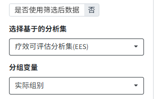
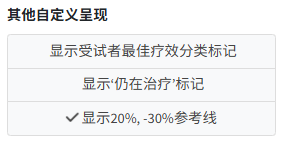
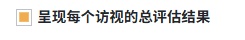
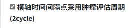

# 02-分析图表相关模块开发指南 <!-- omit in toc -->

>作者：王靖雅 <br>
>发布日期：2025-03-25 <br>
>版本：v1.0

### Content <!-- omit in Content -->
- [Part1：module文件介绍](#part1module文件介绍)
  - [UI部分格式介绍](#ui部分格式介绍)
    - [模板参考](#模板参考)
    - [UI组件](#ui组件)
  - [Server部分格式介绍](#server部分格式介绍)
- [Part2：输出和展示格式\&相关宏介绍](#part2输出和展示格式相关宏介绍)
- [Part3：控制图片输出颜色介绍](#part3控制图片输出颜色介绍)

<hr>

## Part1：module文件介绍
- 每个module是一个单独的图表分析界面，同时包括UI, Server两部分。
- UI部分包含选项，生成按钮，结果展示，结果下载等模块。
- Server部分包含读入ADaM数据，数据处理，数据分析&呈现，以及UI部分选项对应的处理。
- 如果对于汇总类分析表格module，有固定项目和描述类表格，也需要编写tfl.json spec。格式如下:
  ```json
  {
    "type": "Table",
    "category": "Part 2: Safety",
    "Number": "T2_1",
    "title": "Summary of Treatment-Emergent Adverse Events", 
    "footnote1": "N is the number of subjects of each treatment group included in the analysis set. Percentage is calculated only if the numerator is not 0, with N as denominator.",
    "footnote2": "The subject of each group is only calculated once for each row.",
    "adamDataDependency": { 
      #这一部分TFL spec比较自由, 主要用于抓取label和type使用, 每个选项的具体信息和命名可以结合分析填写。比如这个例子里, label是用来在table中进行展示的项目, type我是用来区分调用的函数计算方式, AEACN_Rx和AEACN_Ix来源一同一个变量但不同的衍生方式。
        "TRTEMFLN": {
            "datasetName": "ADAE",
            "variableName": "TRTEMFL",
            "label": "Subjects with adverse events",
            "type": "freq",
            "required": "Y" #同之前,required=Y一般标识一定会出,=N则为该项的依赖变量可能不在所有项目中都收集,可不呈现
        },
        "AEACN_Rx": {
            "datasetName": "ADAE",
            "variableName": "AEACNx",
            "label": "Subjects with dose reduced due to TEAEs",
            "type": "freq",
            "required": "Y"
        },
        "AEACN_Ix": {
            "datasetName": "ADAE",
            "variableName": "AEACNx",
            "label": "Subjects with drug interrupted due to TEAEs",
            "type": "freq",
            "required": "Y"
        }
    }
  }
  ```
- 需满足对同个类型的不同项目均适用。
- 本地测试module时可使用以下格式：
  ```R
  library(shinyEventLogger) #log_init, set_logging_session - 检测module的log输出
  load("adamlike.RData")
  source("mod_xx_XXXX.R", encoding = "utf-8")
  app <- function() {
    set_logging()
    ui <- fluidPage(
      ## module ui
      log_init(),
      mod_xx_XXXX_ui("test")
    )
    server <- function(input, output, session) {
      set_logging_session()
      ## module server
      callModule(mod_xx_XXXX_server, "test", nofilter = reactive(adam_data), filter = reactive(adam_data))
    }
    shinyApp(ui, server)
  }
  app()
  ```

### UI部分格式介绍
#### 模板参考
```r
mod_xx_XXXX_ui <- function(id){
  ns <- NS(id)
  tagList(
    fluidPage(
      fluidRow(
        column(4,
              bs4Card(width = 12,
                      title = h6(icon("gear"), "表格相关选项", style = "color:gray;", align = "center"),
                      collapsible = F,
                      ... #界面操作选项
              ),
        ),
        column(8,
              bs4Card(width = 12,
                      title = h6(icon("table", class="fa-light fa-table-columns"), "总结表", style = "color:gray;", align = "center"),
                      collapsible = F,
                      dropdownMenu = boxDropdown(icon=icon("download"),
                                                  ... #结果展示下拉框提供的下载选项
                      ),
                      uiOutput(ns("tableout")) #结果展示界面
              )
        )
      )
    )
  )
}
```
#### UI组件
> 仅MediSum模块开发项目统一格式适用
- **必须包含的组件:** <br>
   <br> 
  1. 是否使用筛选后数据 **[必须]**
      ```r
      switchInput(
        inputId = ns("filter_yn"),
        label = "是否使用筛选后数据",
        onLabel = "是", offLabel = "否",
        labelWidth = "150px"
      ),
      ```
  2. 选择基于的分析集 **[必须]**
      ```r
      pickerInput(
        inputId = ns("ds_flag"),
        label = "选择基于的分析集",
        choices = c("安全性分析集(SAF)" = "SAF",
                    "疗效可评估分析集(EES)" = "EES",
                    "全分析集(FAS)" = "FAS"), #根据图标需求调整这部分
        selected = "SAF",
        options =  list(style = "btn-outline-dark")
      ),
      ```
  3. 分组变量 **[必须]**
      ```r
      pickerInput(
        inputId = ns("var_groupby"),
        label = "分组变量",
        choices = list(
          "Treatment" = c("实际组别" = "TRT01A"),
          "Other groups" = c("subgroup1",
                            "subgroup2")
        ),
        multiple = FALSE,
        selected = c("TRT01A"),
        options =  list(style = "btn-outline-dark")
      ),
      ```
  4. Generate生成按钮 **[必须]**
      ```r
      actionBttn(
        inputId = ns("generate"), label = "Generate", icon=icon("list-check"),
        color = "primary", block = T, style = "simple"
      )
      ```
  5. 下载按钮 **[必须]**
     ```r
      downloadBttn(
        outputId = ns("download_svg"),
        label = "Plot (.svg)",
        icon=icon("file-image"),
        color = "success",
        size = "sm",
        style = "minimal"
      )
     ``` 
- **其余组件:**
  - 下拉菜单选项型(单选or多选), 统一使用pickerInput(), 格式同上述-分组变量展示。
  - 在界面呈现所有选择的选项型, 统一使用checkboxGroupButtons(), 代码参考:
    
    ```r
    checkboxGroupButtons(
      inputId = ns("addition"),
      label = "其他自定义呈现",
      choices = c("显示受试者最佳疗效分类标记" = "option1",
                  "显示‘仍在治疗’标记" = "option2",
                  "显示20%, -30%参考线" = "option3"),
      selected = c("option3"),
      direction = "vertical",
      justified = T,
      width = "100%",
      checkIcon = list(yes = icon("check", class="fa-solid fa-check fa-bounce"))
    )
    ```
  - 勾选型, prettyCheckbox或checkboxInput, 代码参考: <br>
      
    ```r
    prettyCheckbox(
      inputId = ns("bor_group"),
      label = "以受试者最佳疗效信息分组",
      value = FALSE,
      status = "warning"
    ),
    checkboxInput(
      inputId = ns("xaxis_interval"),
      label = "横轴时间间隔点采用肿瘤评估周期(2cycle)",
      value = FALSE
    )
    ```
  - 依赖于之前选项的显示交互, 使用conditionalPanel实现:
    ```r
    conditionalPanel(
      ns=NS(id),
      condition = "input.addition.includes('option2')", #当满足该条件时,呈现后续选项
      prettyCheckbox(
        inputId = ns("oth_eot"),
        label = "使用外部数据中变量判断终止治疗状态",
        value = FALSE,
        status = "warning"
      ),
      uiOutput(ns("eot_depend"))
    )
    ```

### Server部分格式介绍
> 仅MediSum模块开发项目统一格式适用

**模板参考:**
```r
mod_xx_XXXX_server <-
  function(input, output, session, nofilter, filter) {
    ns <- session$ns
    set_logging_session() #LOG SESSION ID

    ## step1: 数据初步处理 ----
    adsl <- reactive({
      ### 包含对是否调用filter数据的处理 & 数据集flag筛选
    })
    adxx <- reactive({...})
    table_data <- reactive({
      ### 数据合并 left_join
    })

    ## step2: 选项交互 ----
    observeEvent(table_data(), {
      ### 根据数据给界面的选项提供交互内容
    })

    ## step3: 分析数据生成 ----
    observeEvent(input$generate,{
      log_event("TFL GENERATE:xx_XXXX") #LOG: TFL GENERATE

      ### 如有tfl spec,在这一步读入
      tryCatch( #### trycatch会在提示图表无法生成时报错
        {
         ### 1. 数据处理 & 表格/图片生成命令
         ...
         ### 2. 根据界面交互选项更新下载文件title
         ...
         ### 3. table展示
          output$tableout <- renderUI({
            div(style='max-height:700px; overflow-y: auto; overflow-x: auto; font-size:80%',
                ...
            )
          })
         ### 4. 结果下载
          output$download_docx <- downloadHandler(
            filename = function() {
              paste0(title, "_", Sys.Date(), '.docx')
            },
            content = function(filename) {
              log_event("TFL DOWNLOAD:xx_XXXX-TABLE_DOCX") #LOG: TFL DOWNLOAD
              ...
            }
          )
        },
        error=function(e) {
          message('Error: Fail to generate xx_XXXX (code issue)')
          shinyalert::shinyalert(title= "TFL Fail", text = "无法生成该图表，请重试或联系开发者(ERROR_CODE: xx)",
                                 type = "error",
                                 confirmButtonText = "OK", confirmButtonCol = "#93c54b"
          )
        }
      )
    })
  }
```
<hr>

## Part2：输出和展示格式&相关宏介绍
> 仅MediSum模块开发项目统一格式适用
- 如使用tern包或rtables包进行数据分析汇总，需统一以以下格式输出和展示。
  ```R
  ## table output
  output$tableout <- renderUI({
  div(style='max-height:700px; overflow-y: auto; overflow-x: auto; font-size:80%',
      rtables::as_html(result)
  )
  })

  ## file download
  output$download_docx <- downloadHandler(
  filename = function() {
      paste0(title, "_", Sys.Date(), '.docx')
  },
  content = function(filename) {
      docx_style <- rtables::theme_docx_default(result,
                                              font_size = 9,
                                              font = "Times New Roman",
                                              border = flextable::fp_border_default(width = 0.5),
                                              bold = c("header"),
                                              bold_manual = NULL
      )
      tt <- rtables::tt_to_flextable(result,
                                      theme = docx_style
      ) %>% flextable::theme_booktabs(bold_header = T)
      export_as_docx(tt, file = filename,
                      titles_as_header = FALSE, footers_as_text = FALSE,
                      section_properties = section_properties_landscape())
  }
  )
  ```
- 如自行编写汇总程序，且数据分析汇总最终格式为data.frame，需统一以以下格式输出和展示。hr_rtf_style()为编写好的类似恒瑞输出格式函数，可直接调用。
  ```R
  ## table output
      output$tableout <- renderDataTable({
          if (nrow(ae_table) == 0) {
          data.frame(COL = "没有符合此表的数据")
          } else {
          ae_table
          }

      },
      escape = FALSE,
      extensions = c("FixedColumns", "FixedHeader", "RowGroup"),
      options = list(scrollX = TRUE, pageLength = 10,
                      fixedColumns = list(leftColumns = 1),
                      rowGroup = list(dataSrc = 1),
                      columnDefs = list(list(targets = c(0,1), visible = FALSE)),
                      fixedHeader = TRUE),
      selection = "none"
      )
  ## file download
  output$download_rtf <- downloadHandler(
      filename = function() {
      paste0(title, "_", Sys.Date(), '.rtf')
      },
      content = function(filename) {
      req(ae_table)
      if (nrow(ae_table) == 0) {
          showNotification(sprintf("没有符合此表的数据, 无法下载"), type = "message")
      } else {
          ae_table %>%
          hr_rtf_style(
              title = r2rtf::utf8Tortf(title),
              subtitle = ifelse(!is.null(input$pt_filter),
                              r2rtf::utf8Tortf(paste0("PT: ", paste0(input$pt_filter, collapse = ", "))), ""),
              header1 = header1,
              header2 = header2,
              colwidth = c(3, rep(round(7/(length(names(ae_table))-1), 2), length(names(ae_table))-1)),
              textjust = c("l", rep("c", length(names(ae_table))-1)),
              footer = c("xxx"),
              source = "ADAE",
              cutoffdate = nofilter()$CUTOFFDATE,
              filename = filename
          )
      }
      }
  )
  ```
<hr>

## Part3：控制图片输出颜色介绍
> 仅MediSum模块开发项目统一格式适用
- 统一使用fct_ggplot_mycolor.R中颜色的配置。
- ggplot绘图调用代码参考：
  ```r
    plot_data$plot <- ggplot2::ggplot() +
        scale_fill_cvi_d("mycol") / scale_colour_cvi_c("mycol")
  ```
- 绘图部分需参考其他文件格式，提供绘图细节调整功能。