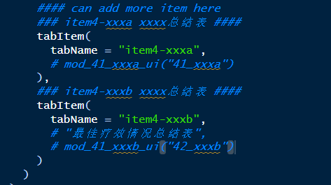

# 03-基于MediSum模块开发项目的ShinyApp整合指南 <!-- omit in toc -->

>作者：王靖雅 <br>
>发布日期：2025-03-25 <br>
>版本：v1.0

### Content <!-- omit in toc -->
- [Part1：整合数据生成步骤](#part1整合数据生成步骤)
- [Part2：UI设计](#part2ui设计)
- [Part3：Server \& module调用](#part3server--module调用)
- [Plus：Log输出\&存档](#pluslog输出存档)
<hr>

## Part1：整合数据生成步骤

- 在**mod_01_DataUpload.R**文件中搜索**adam-like data gen part**，并在对应部分仿照之前语句添加adam数据生成语句。
  
- 可在完成gen_adxx函数编写后添加至该部分，并运行MediSum测试是否能流畅生成所需ADaM。
- 对于非肿瘤项目，需要在这一段增加对于适配adam名称。
  

## Part2：UI设计

- MediSum UI调用的bs4Dash包组件，仅需在**app_ui.R**文件中指定位置添加和填写对应module-ui即可。其他内容禁止修改。
- 搜索**SIDEBAR PART**，更新侧栏中显示名称及UI icon。
   
- 搜索**BODY items (main part)**，更新侧栏对应的界面及module-ui。
  

## Part3：Server & module调用

- 在**app_server.R**文件中指定位置添加和填写对应module-ui即可。其他内容禁止修改。
- 参考代码：
```r
  if ("ADTRT" %in% names(adamdata()) && nrow(adamdata()$ADTRT) != 0) {
        callModule(mod_35_spider_server, "35_spider", nofilter = adamdata, filter = adamdata_filter)
      } else {
        observe({
          if (input$tabs == "item3-spider") {
            shinyalert(title = "未收录ADTRT相关数据，无法使用该界面", type = "warning",
                       closeOnClickOutside = T, showConfirmButton = F)
          }
        })
      }
```
<hr>

## Plus：Log输出&存档
- 常用log输出命令：message(xxx)
- **log输出计数：【重要板块】**
  - 在每个mod_xxx_server的**开始部分**增加，开始log文件的输出：
    ```r
    set_logging_session() #LOG SESSION ID
    ```
  - 在文件mod_xx_xxx.R中，需要在**step3: generate table**部分类似添加代码，表示用户生成了一次对应图表：
    ```r
    log_event("TFL GENERATE:xx_xxx") #LOG: TFL GENERATE
    ```
  - 在文件mod_xx_xxx.R中，需要在**每个下载部分**类似添加代码，表示用户下载了一次对应图表：
    ```r
    log_event("TFL DOWNLOAD:21_TEAEsum-TABLE_DOCX")
    ```
  - 输出信息会呈现至项目文件夹的events.log中
  - 参考{shinyEventLogger}使用说明文档：https://kalimu.github.io/shinyEventLogger/