# R Package相关网址存档

## pharmaverse 大合集
https://pharmaverse.org/
https://pharmaverse.github.io/blog/

## 数据生成相关

#### {sdtm.oak}： 生成sdtm部分变量的包
https://pharmaverse.github.io/sdtm.oak/index.html
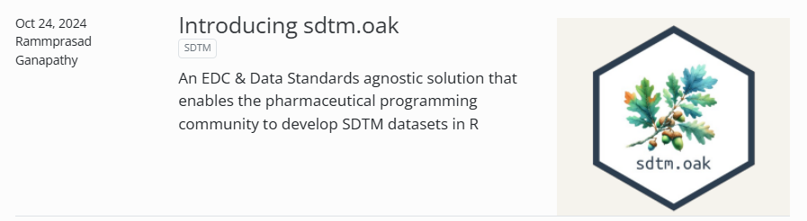

#### {admiral}：数据生成中简化的好用function
https://pharmaverse.github.io/admiral/cran-release/
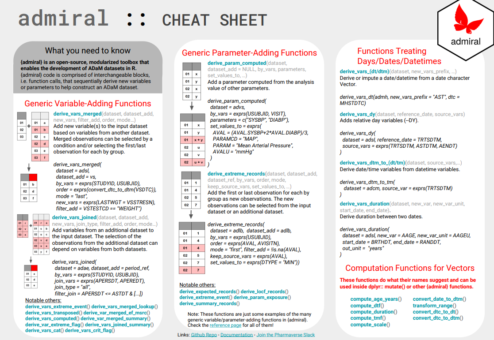
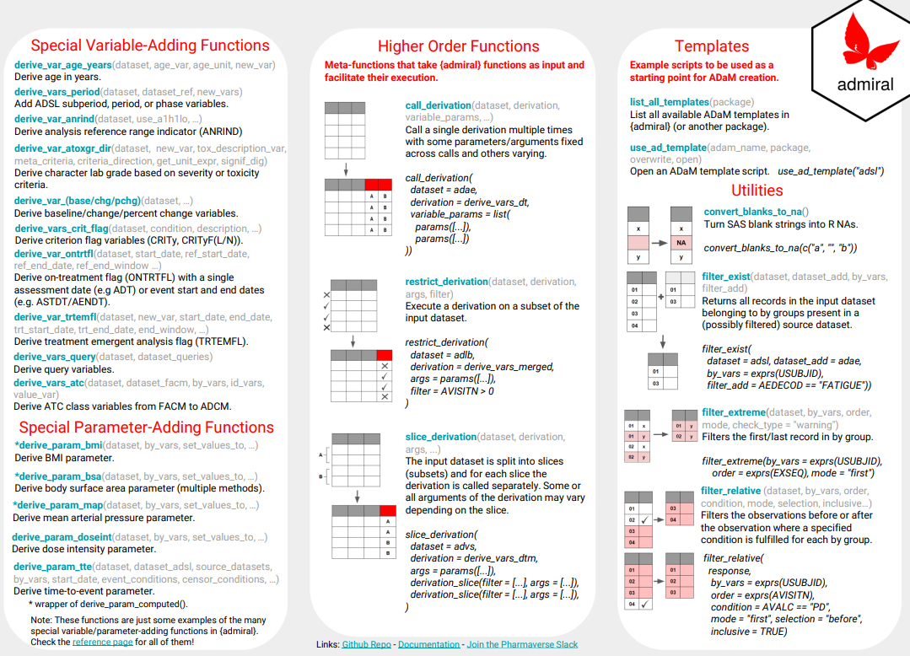

#### {xportr}: r输出xpt格式文件
https://atorus-research.github.io/xportr/
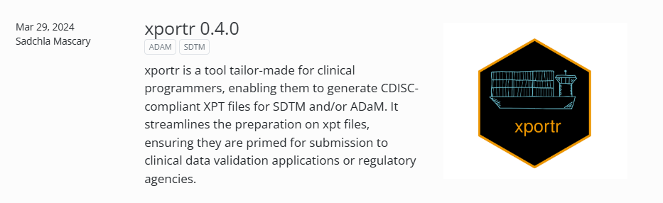

## TFL相关

#### TLG catalog：包含大多数的图表制作方法和代码 
https://insightsengineering.github.io/tlg-catalog/stable/
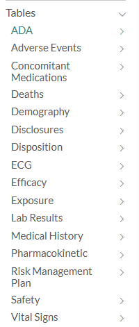

#### {rtables}: 基础的表格出具 & {rtables.office}: 表格输出下载部分（从0.6.11版本后从rtables独立出来）
https://insightsengineering.github.io/rtables/latest-release/reference/build_table.html
https://insightsengineering.github.io/rtables.officer/
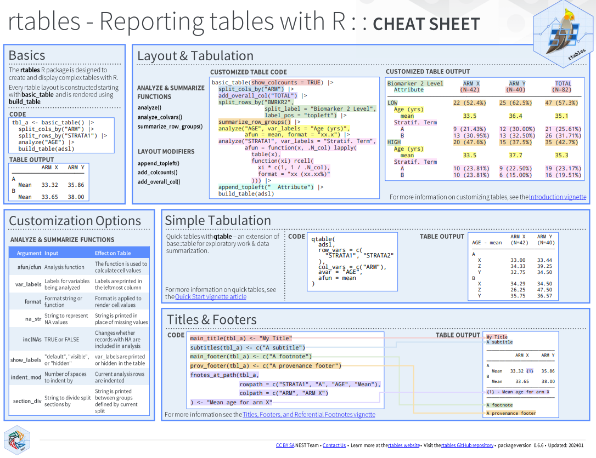
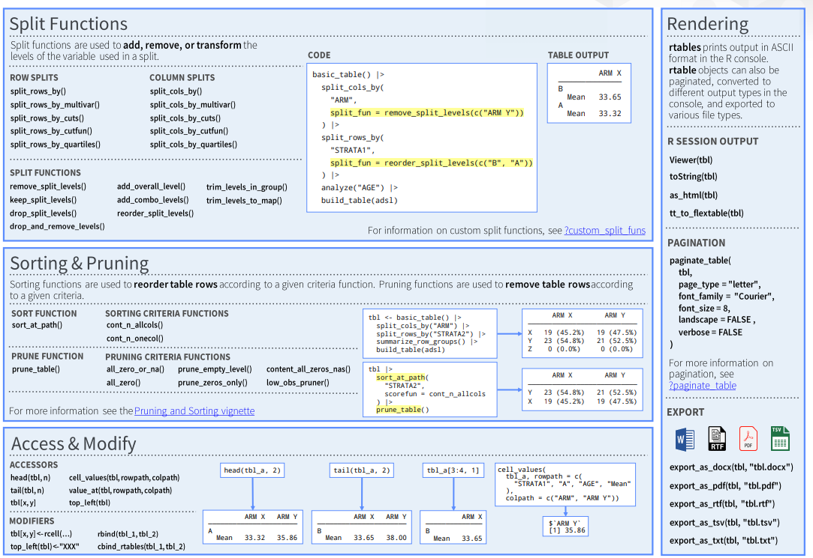

#### {tern}: rtables进阶版，包含很多分析方法的表格出具
https://insightsengineering.github.io/tern/latest-tag/
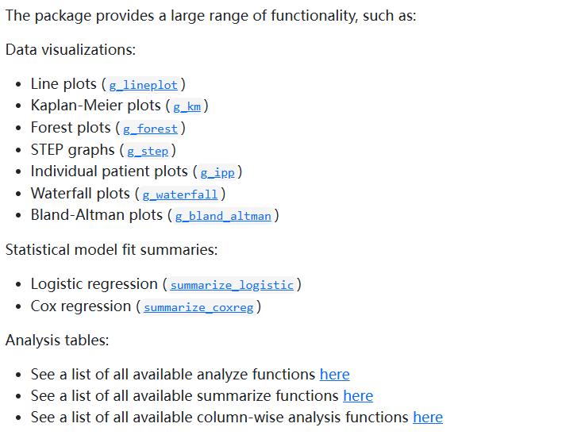

#### {tidytlg}: 我还没用过
https://pharmaverse.github.io/tidytlg/main/

## AI相关

#### {ellmer}: 提供各大AI调用模式  
https://ellmer.tidyverse.org/index.html
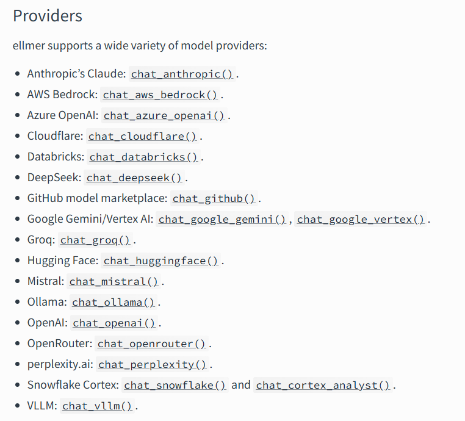

#### {shinychat}: shiny ai聊天框 
https://posit-dev.github.io/shinychat/r/index.html
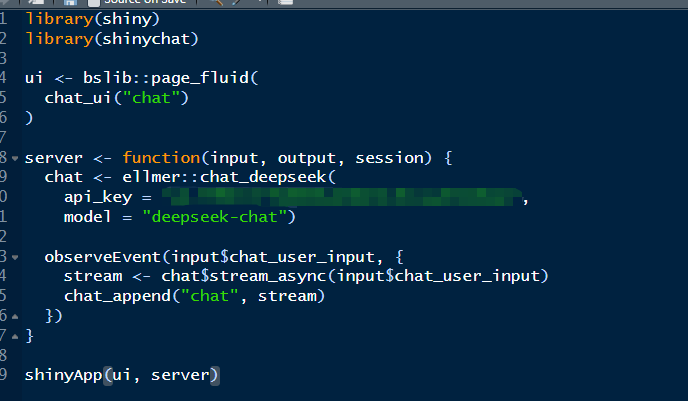

## shiny参考

#### tidyCDISC
https://rinpharma.shinyapps.io/tidyCDISC/
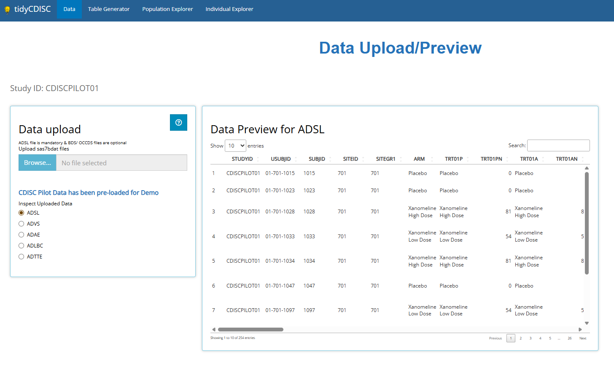

#### teal.gallery: 罗氏的开源shiny搭建模块
说明：https://insightsengineering.github.io/teal.gallery/
demo：https://insightsengineering.github.io/teal.gallery/demo.html
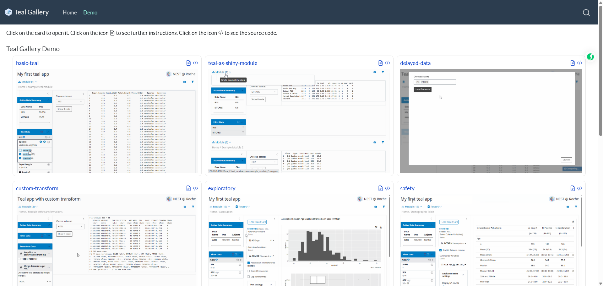

#### {aNCA}： 没试过，研究一下！
https://pharmaverse.github.io/aNCA/articles/aNCA.html

## 其他

#### {renv}:控制project中package环境  
https://rstudio.github.io/renv/

#### submission pilot workshop
主要的pilot流程和说明：https://rconsortium.github.io/submissions-wg/
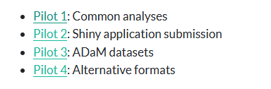
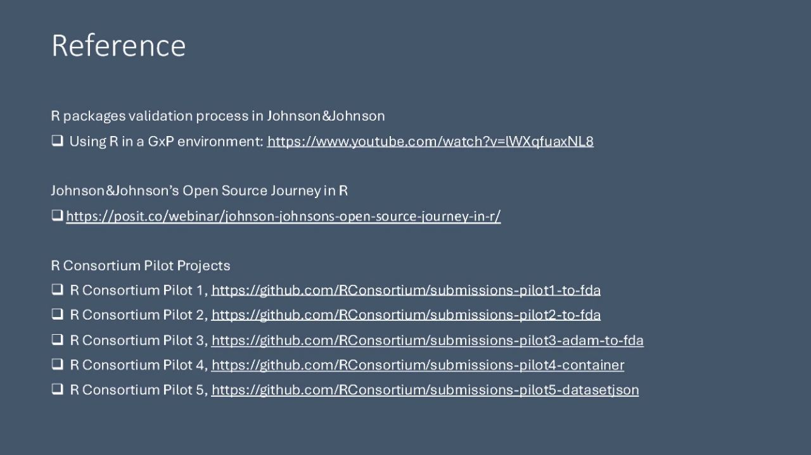

#### submission pilot3：可以参考代码使用和流程搭建规范
https://github.com/RConsortium/submissions-pilot3-adam-to-fda/tree/main
https://mp.weixin.qq.com/s/E8HGBpHlvxQaOCltv-wfJg
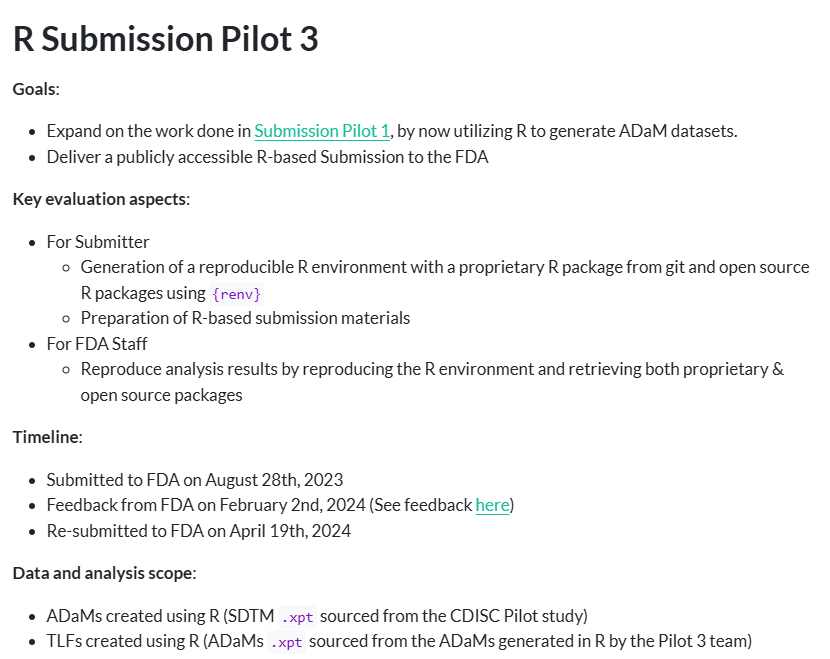
