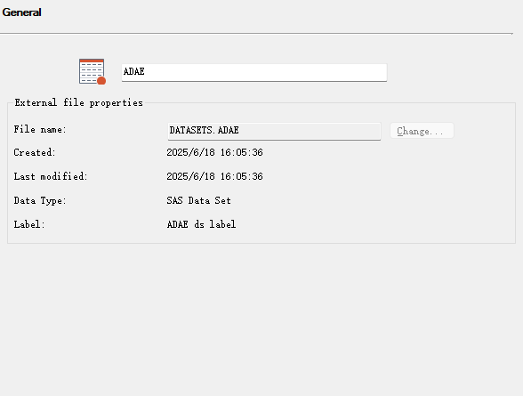

# XPT文件导出与读取

## 概述

这个笔记来源于R taskforce出现的导出xpt无法打开的问题。


## 步骤1： R中输出xpt

r中与sas数据&xpt读入相关的包主要是haven。
```r
# 安装
library(haven)

# 写入XPT文件
write_xpt(adae, "C:/Users/wangjy35/Downloads/test/xpt/adae.xpt", version = 5, name = "ADAE", label = "ADAE ds label")

## version = 5 限定不要改，会影响读入
## name = xx是设定数据集名字
## label = xx是设定数据集，会显示在properties中
```

## 步骤2： SAS读取和检查XPT文件

```SAS
libname xptin xport  "C:\Users\wangjy35\Downloads\test\xpt\adae.xpt";
libname datasets 'C:\Users\wangjy35\Downloads\test\data';
proc copy in=xptin out=datasets;
run;
```

