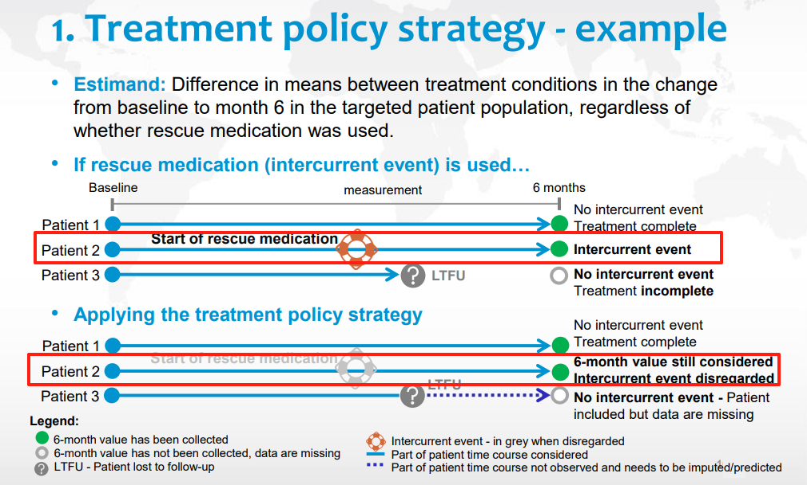
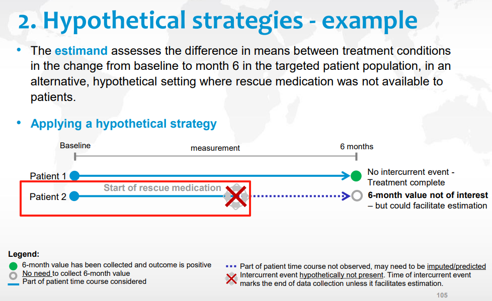
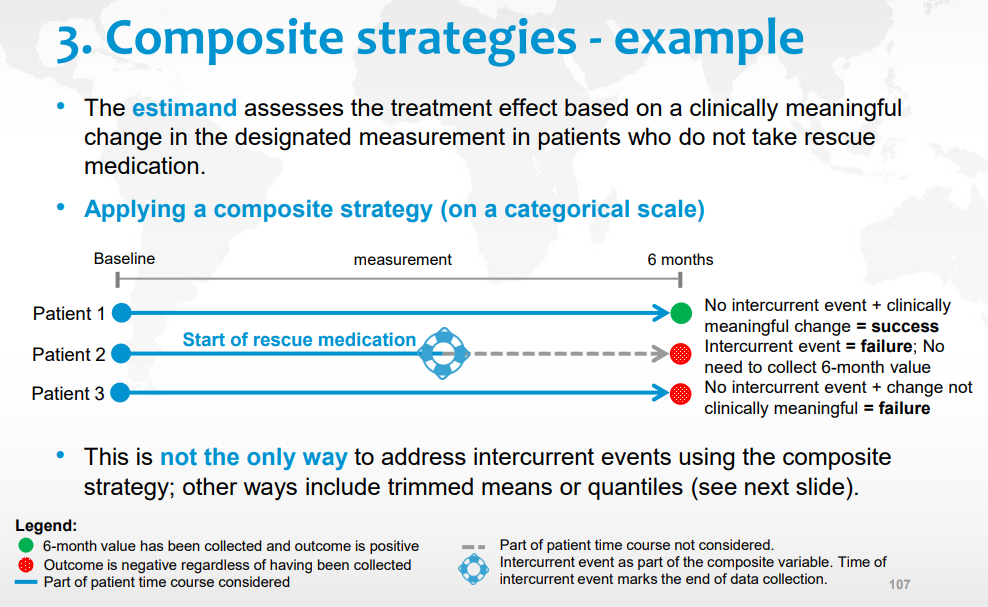
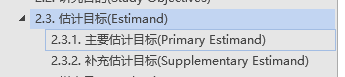
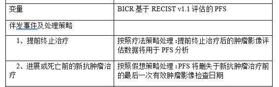
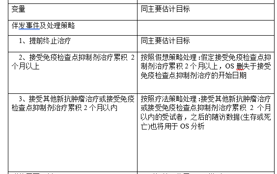

# Estimand实战经验分享 <!-- omit in toc -->

>作者：王靖雅 <br>
>发布日期：2025-06-25 <br>
<!-- >参考项目：1210-329 -->

## Content <!-- omit in toc -->
- [Estimand基本概念](#estimand基本概念)
- [实操案例](#实操案例)
  - [SAP](#sap)
  - [ADICE - 伴发事件分析数据集](#adice---伴发事件分析数据集)
  - [ADTTE](#adtte)
- [参考资料](#参考资料)
<hr>

## Estimand基本概念
- **伴发事件：**
  
  治疗开始后发生的事件，可影响与临床问题相关的观测结果的解读或存在。

  常见种类：终止治疗，其他治疗，终末事件

  

- **对应解决策略 - 5种策略**

    疗法策略 - 不管是否有伴发事件发生

    假想策略 - 伴发事件没有发生

    复合变量策略 - 在目标变量定义中考虑

    在治策略 - 伴发事件发生之前的治疗效应

    主层策略 - 通过人群定义

- **疗法策略**

  

  接受伴发事件的发生，并视作为正常存在的节点，使用所有的数据进行分析。

- **假想策略**

  

  假设没有伴发事件的发生，即从伴发事件节点后的所有信息都缺失了。

- **复合变量策略**

  

  把伴发事件视为一种结果/结局。伴发事件后的信息不重要且不考虑。

- **在治策略**

  

  我的理解是把伴发事件视为右删失。即只使用伴发事件发生前的数据。

- **主层策略**
  
  

  与人群有关的策略。

## 实操案例
### SAP


- **主要研究目的1**
  
  

- **主要研究目的2**
  
  
  
- **主要研究目的2的补充估计目标1**
  
  

- **主要研究目的2的补充估计目标2**
  
  

**注意**：上述描述中使用的【删失于】不太标准，可能造成处理上的误解和后续ADTTE生成过程中对事件或删失处理的逻辑冗杂。建议使用以下截图中的描述和理解思路。

<!--
#### 建议的SAP中描述

-->

### ADICE - 伴发事件分析数据集
**具体思路：**
1. 总结上述伴发事件的类型，比如这个项目中包含五类伴发事件：
   提前终止治疗，接受新抗肿瘤治疗，对照组受试者接受卡瑞利珠单抗治疗，接受免疫检查点抑制剂治疗累积2个月以上，接受其他新抗肿瘤治疗或接受免疫检查点抑制剂治疗累积2个月以内

2. 总结估计目标，比如这个项目中：
   估计目标1，估计目标2，估计目标2的补充估计目标1，估计目标2的补充估计目标2

3. 做了EST01STR，EST02STR，ES02SST1，ES02SST2这四个变量，用来存放对每个不同估计目标中对各个伴发事件的处理策略。

4. 对每个受试者中的伴发事件进行抓取。
    ```SAS
    ## 提前终止治疗判断规则
    data eot;
    set adsl;
      if EOT01STT="已终止";
      if missing(tr02sdt) then eotdt = max(of eotdt01-eotdt06); else eotdt = max(of eotdt03-eotdt06);
      if eotdt < f_pddth or missing(f_pddth) then PFSEOTFL = "Y";
      if eotdt < dthdt or missing(dthdt) then OSEOTFL = "Y";
      **排除终止治疗原因;
      if missing(tr02sdt) and ^missing(DCTRS01) and (index(DCTRS01, "35") or index(DCTRS01, "17")) then call missing(PFSEOTFL, OSEOTFL);
      _DCTRS = catx("-", of DCTRS03-DCTRS05);
      if ^missing(_DCTRS) and index(_DCTRS, "6") then call missing(PFSEOTFL, OSEOTFL);
    keep usubjid PFSEOTFL OSEOTFL EOTSTT  eotdt dthdt DCTRS01 _DCTRS;
    run;

    data adice1;
    set eot;
    if ^missing(PFSEOTFL) or ^missing(OSEOTFL);
      ATERM = "提前终止治疗";
      ACAT1 = "提前终止治疗";
      ASTDT = eotdt;
      SRCDOM = "ADSL";
      if PFSEOTFL = "Y" then EST01STR = "疗法策略";
      if OSEOTFL = "Y" then do;
        EST02STR = "疗法策略";
        ES02SST1 = "疗法策略";
        ES02SST2 = "疗法策略";
      end;
    run;
    ```

5. 以下为当前案例项目中的使用格式，具体请参考部门Estimand spec规范。
   
    

    

**注意：** 这里呈现的策略为会对估计目标变量造成影响的实际策略，比如截图中，“接受新抗肿瘤治疗”这个伴发事件有发生，但对于主要估计目标1-PFS这个变量来说，并没有发生在PD或死亡的事件前，故EST01STR没有赋值为“假想策略”。

### ADTTE
**注意：** 建议直接调用ADICE中的伴发事件日期。

1. 只有疗法策略 - 无需调用ADICE。
   
  

2. 存在假想策略 - 使用ADICE中的伴发事件日期加入判断或进行cut。

**案例1：**


```SAS
  ** ---------------------------------------------------------------;
  ** PFS_BICR - 基于进展或死亡前的新抗肿瘤治疗前的adrs数据集分析
  ** PFS将删失于新抗肿瘤治疗前的最后一次有效肿瘤影像检查日期
  ** 伴发事件 假想策略：接受新抗肿瘤治疗
  ** ---------------------------------------------------------------;
  data adrs_birc;
    set adamprt.adrs;
    where paramcd="OVRLRESP" and ^missing(avalc) and ^missing(adt) and PARCAT1="RECIST 1.1";
    if RSEVAL="独立评估员" and RSACPTFL="Y";
  run;
  proc sql;
    create table adrs_birc_pfs as
    select a.*, b.astdt as f_anti, c.dthdt, c.randdt
    from adrs_birc as a
    left join adamprt.adice(where=(ATERM = "接受新抗肿瘤治疗")) as b on a.usubjid=b.usubjid
    left join adamprt.adsl as c on a.usubjid=c.usubjid
    having adt <= f_anti or missing(f_anti);
  run;
```

**案例2：**


```sas
  ** ---------------------------------------------------------------;
  ** OS2 - 补充估计目标OS2;
  ** 伴发事件 假想策略: 接受免疫检查点抑制剂治疗累积2个月以上;
  ** ---------------------------------------------------------------;
  proc sql;
    create table adsl_os2 as
    select a.*, b.astdt as cmflagdt
    from adamprt.adsl(where=(ITTFL="Y")) as a
    left join adamprt.adice(where=(ATERM = "接受免疫检查点抑制剂治疗累积2个月以上" and ES02SST2="假想策略")) as b on a.usubjid=b.usubjid;
  run;
  data adsl_os2_cut;
    set adsl_os2;
    if ^missing(cmflagdt) then do;
      lstalvdt = cmflagdt;
      call missing(dthdt);
    end;
  run;

  data adtte22;
    set adsl_os2_cut;
    length evntdesc cnsdtdsc paramcd param $200;
    format startdt adt yymmdd10.;
    ** OS;
    paramcd = "OS3"; param="Overall Survival (Months) - Supplementary2";
    if ^missing(dthdt) then do;
      cnsr=0;
      startdt = randdt; adt=dthdt;
      evntdesc="死亡"; evntdesn = 1;
      cnsdtdsc="";
    end;
    else if ^missing(cmflagdt) then do;
      cnsr=1;
      startdt = randdt; adt=cmflagdt;
      evntdesc="接受免疫检查点抑制剂治疗累积2个月以上"; evntdesn = 4;
      cnsdtdsc="接受免疫检查点抑制剂治疗的开始日期";
    end;
    ** 其余不重要的代码已省略...;
  run;
```

----
## 参考资料
- [SharePoint > Programming Group Meeting > Estimand_Learning](https://sharepoint.sha.hengrui.com/sites/TaskForce/Programming%20Group%20Meeting/Forms/AllItems.aspx?id=%2Fsites%2FTaskForce%2FProgramming%20Group%20Meeting%2FEstimand%5FLearning)
- [SharePoint > Estimand细节梳理工作组](https://sharepoint.sha.hengrui.com/sites/TaskForce/Estimand/Forms/AllItems.aspx)
- [E9(R1) Training Material - Training Module 2.3: Estimands](https://database.ich.org/sites/default/files/E9%28R1%29%20Training%20Material%20-%20PDF_0.pdf)

---- 